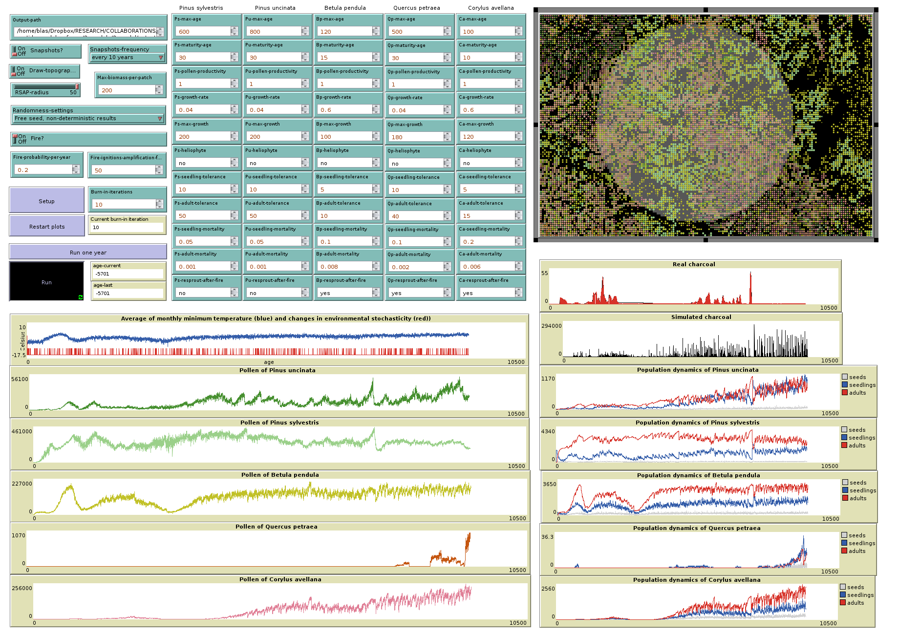

# PalaeoFireModeling

This model is described in the paper in prep. titled *Forest - fire interactions in the Central Pyrenees: a data-model comparison for the Lateglacial-Holocene transition*, and authored by Graciela Gil-Romera, Blas M. Benito, Juli G. Pausas, Penélope González-Sampériz, J. Julio. Camarero, Jens-Christian Svenning, and Blas Valero-Garcés.

This agent-based model coded in Netlogo simulates the effect of fire on forest dynamics (5 species) over millenial time scales. This text is a work in progress, but the model is fully functional, and a paper describing it will be available soon.

## WHAT IS IT?

This is a spatio-temporal simulation of the effect of fire regimes on the population dynamics of five forest species (Pinus sylvestris, Pinus uncinata, Betula pendula, Corylus avellana, and Quercus petraea) during the Lateglacial-Holocene transition (15-7 cal Kyr BP) at El Portalet, a subalpine bog located in the central Pyrenees region (1802m asl, Spain), that has served for palaeoenvironmental studies (González-Smapériz et al. 2006; Gil-Romera et al., 2014). A short demo video can be found here: https://vimeo.com/274750111.

## HOW DOES IT WORK

### Abiotic component

The abiotic layer of the model is represented by three main environmental factors:

+ **Topography** derived from a digital elevation model at 200 x 200 meters resolution. Slope (along temperature) is used to impose restrictions to species distributions. Northness (in the range [0, 1]) is used to restrict fire spread. Aspect is used to draw a shaded relief map (at the user's request). Elevation is used to compute a lapse rate map (see below).

+ **Temperature** (average of montly minimum temperatures) time series for the study area computed from palaeoclimatic data at annual resolution provided by the [TraCe simulation](http://www.cgd.ucar.edu/ccr/TraCE/), a transient model for the global climate evolution of the last 21K years with an annual resolution. The single temperature value of every year is converted into a temperature map (200 x 200 m resolution) using a lapse rate map based on the elevation map. Temperature, along with slope, is used to compute habitat suitability by using a logistic equation. Habitat suitability affects plant growth and survival.

+ **Fire**: The charcoal accumulation rate record (CHAR) from El Portalet palaeoenvironmental sequence (Gil-Romera et al., 2014) is used as input to simulate forest fires. A value of this time series is read each year, and a random number in the range [0, 1] is generated. If the random number is lower than the *Fire-probability-per-year* (FPY) parameter defined by the user, the value from the charcoal time series is multiplied by the parameter *Number-ignitions-per-fire-event* (NIF) (defined by the user) to compute the number of ignitions for the given year. As many adult tree as ignitions are selected to start spreading fire. Fire spreads to a neighbor patch if there is an adult tree in there, and a random number in the range [0, 1] is higher than the northness value of the patch.

### Biotic component

The biotic layer of the model is composed by five tree species. We have introduced the following elements to represent their ecological dynamics:

+ **Topoclimatic niche**, inferred from their present day distributions and high resolution temperature maps (presence data taken from GBIF, temperature maps taken from Worldclim and the Digital Climatic Atlas of the Iberian Peninsula). The ecological niche is represented by a logistic equation (see below). The results of this equation plus the dispersal dynamics of each species defines changes in distribution over time.

+ **Population dynamics**, driven by species traits such as dispersal distance, longevity, fecundity, mortality, growth rate, post-fire response to fire, and heliophity (competition for light). The data is based on the literature and/or expert opinion from forest and fire ecologists, and it is used to simulate growth (using logistic equations), competition for light and space, decay due to senescence, and mortality due to climate, fire, or plagues.

The model doesn't simulate the entire populations of the target species. Instead, on each 200 x 200 meters patch it simulates the dynamics of an small forest plot (around 10 x 10 meters) where a maximum of one individual per species can exist.

### Model dynamics

**The life of an individual**

During the model setup seeds of every species are created on every patch. From there, every seed will go through the following steps every simulated year:

+  Its age increases by one year, and its life-stage is changed to "seedling".

+  The minimum average temperature of its patch is updated.

+  The individual computes its habitat suitability using the logistic equation *1 / ( 1 + exp( -(intercept + coefficient * patch-temperature)))*, where the *intercept* and the *coefficient* are user defined. These parameters are hardcoded to save space in the GUI, and have been computed beforehand by using current presence data and temperature maps. 

    +  If habitat suitability is higher than a random number in the range [0, 1], the habitat is considered suitable (NOTE: this random number is defined for the patch, and it changes every ~10 years following a random walk drawn from a normal distribution with the average set to the previous value, and a standard deviation of 0.001).

    +  If it is lower, the habitat is considered unsuitable, and the number of years under unsuitable habitat is increased by 1.

        + If the number of years unders unsuitable habitat becomes higher than *seedling-tolerance*, the seedling dies, and another seed from the seed bank takes its place. Otherwise it stays alive.

+  Mortality: If a random number in the range [0, 1] is lower than the seedling mortality of the species the plant dies, and it is replaced by a seed from the seed bank. Otherwise it stays alive.

+  Competition and growth:

   +  If the patch total biomass of the individuals in the patch equals *Max-biomass-per-patch*, the individual loses an amount of biomass between 0 and the 20% of its current biomass. This number is randomly selected.

   + If *Max-biomass-per-patch* has not been reached yet:

       + An *interaction term* is computed as *(1 - (biomass of other individuals in the patch / Max-biomass-per-patch)) * (1 - heliophilia))*. 

       + The interaction term is introduced in the growth equation *max-biomass / (1 + max-biomass * exp(- growth-rate * interaction-term * habitat-suitability * age))* to compute the current biomass of the individual. The lower the interaction term and habitat suitability are, the lower the growth becomes.

+  If a fire reaches the patch and there are adult individuals of other species on it, the plant dies, and it is replaced by a seed (this seed inherites the traits of the parent).

These steps continue while the individual is still a seedling, but once it reaches its maturity some steps become slightly different:

+  If a random number in the range [0, 1] is lower than the adults mortality of the species, or the maximum age of the species is reached, the individual is marked for decay. The current biomass of decaying individuals is computed as *previous-biomass - years-of-decay*. To add the effect of climatic variability to this decreasing function, its result is multiplied by *1 - habitat-suitability x random[0, 10]*. If the biomass is higher than zero, pollen productivity is computed as *current-biomass x species-pollen-productivity*. The individual dies and is replaced by a seed when the biomass is below 1.

+  Dispersal: If the individual is in suitable habitat, a seed from it is placed in one of the neighboring patches within a radius given by the dispersal distance of the species (which is measured in "number of patches" and hardcoded) with no individuals of the same species.

+  If the individual starts a fire, or if fire spreads in from neighboring patches, it is marked as "burned", spreads fire to its neighbors, dies, and is replaced by a seed. If the individual belongs to an species with post-fire resprouting, the growth-rate of the seed is multiplied by 2 to boost growth after fire.

**Simulating pollen and charcoal deposition**

The user defines the radius of a catchment area round the core location (10 km by default, that is 50 patches). All patches within this radius define the RSAP (relevant source area of pollen). 

At the end of every simulated year the pollen productivity of every adult of each species within the RSAP is summed, and this value is used to compose the simulated pollen curves. The same is done with the biomass of the burned individuals to compose the virtual charcoal curve.

### Output

**In GUI**

The simulation GUI shows the following results in real time:

+  Plots of the input values:
	+ Minimum Temperature of the coldest month.
	+ Real charcoal data.

+  Simulated pollen curves for the target taxa.

+  Simulated charcoal curve.

+  Map showing the distribution of every species and the forest fires.

**Written to disk**

The simulated pollen counts and charcoal is exported to the path defined by the user as a table in csv format named **output_table.csv**. It contains one row per simulated year and the following columns:

+  age: simulated year.
+  temperature_minimum_average: average minimum winter temperature of the study area.
+  pollen_Psylvestris: pollen sum for Pinus sylvestris.
+  pollen_Puncinata
+  pollen_Bpendula
+  pollen_Cavellana
+  pollen_Qpetraea
+  real_charcoal: real charcoal values from El Portalet core.
+  ignitions: number of fire ignitions.
+  charcoal_sum: biomass sum of all burned individuals.
+  charcoal_Psylvestris: sum of the biomass of burned individuals of Pinus sylvestris.
+  charcoal_Puncinata
+  charcoal_Bpendula
+  charcoal_Cavellana
+  charcoal_Qpetraea

Snapshots of the simulation map taken at 1 or 10 years intervals are stored in the output folder is requested by the user. These snapshots are useful to compose a video of the simulation.

## HOW TO USE IT

### Input files

Input files are stored in a folder named "data". These are:

+  **age**: text file with no extension and a single column with no header containing age values from -15000 to -5701 
+  **fire**: text file with no extension and a single column with no header containing actual charcoal counts expresed in the range [0, 1]. There are as many rows as in the **age** file
+  **t_minimum_average**: text file with same features as the ones above containing minimum winter temperatures for the study area extracted from the TraCe simualtion.
+  **correct_t_minimum_average.asc**: Map at 200m resolution containing the minimum winter temperature difference (period 1970-2000) between the TraCe simulation and the Digital Climatic Atlas of the Iberian Peninsula. It is used to transform the values of **t_minimum_average** into a high resolution temperature map.
+  **elevation.asc**: digital elevation model of the study area at 200m resolution, coordinate system with EPSG code 23030.
+  **slope.asc**: topographic slope.
+  **topography.asc**: shaded relief map. It is used for plotting purposes only.

### Input parameters

**General configuration of the simulation**

The user can set-up the following parameters throught the GUI controls.

+  **Output-path**: Character. Path of the output folder. This parameter cannot be empty, and the output folder must exist.
+  **Snapshots?**: Boolean. If on, creates snapshots of the GUI to make videos.
+  **Snapshots-frequency**: Character. Defines the frequency of snapshots. Only two options: "every year" and "every 10 years".
+  **Draw-topography?**: Boolean. If on, plots a shaded relief map (stored in **topography.asc**).
+  **RSAP-radius**: Numeric[5, 50]. Radius of the RSAP in number of patches. Each patch is 200 x 200 m, so an RSAP-radius of 10 equals 2 kilometres.
+ **Randommness-settings**: Character. Allows to choose between "fixed seed" to obtain deterministic results, or "free seed" to obtain different results on each run.
+  **Max-biomass-per-patch**: Numeric, integer. Maximum charge capacity of a patch.
+  **Fire?**: Boolean. If on, fires are produced whenever the data **fire** triggers a fire event. If off, fires are not produced (control simulation).
+  **Fire-probability-per-year**: Numeric [0, 1]. Whenever the **fire** file provides a number higher than 0, if a random number in the range [0, 1] is lower than **Fire-probability-per-year**, a number of ignitions is computed (see below) and fires are triggered.
+  **Fire-ignitions-amplification-factor**: Numeric  The **fire** file provides values in the range [0, 1], and this multiplication factor converts these values in an integer number of ignitions. If **fire** equals one, and **Fire-ignitions-amplification-factor** equals 10, the number of ignitions will be 10 for the given year.
+  **Mortality?**: Boolean. If on, mortality due to predation, plagues and other unpredictable sources is active (see **Xx-seedling-mortality** and **Xx-adult-mortality** parameters below).
+  **Burn-in-iterations**: Numeric, integer. Number of years to run the model at a constant temperature (the initial one in the **t_minimum_average** file) and no fires to allow the population model to reach an equilibrium before to start the actual simulation.
+ **P.sylvestris?**, **P.uncinata?**, **B.pendula?**, **Q.petraea?**, and **C.avellana?**: Boolean. If off, the given species is removed from the simulation. Used for testing purposes.

**Species traits**

Each species has a set of traits to be filled by the user. Note that a particular species can be removed from the simulation by switching it to "off". 

+  **Xx-max-age**: Numeric, integer. Maximum longevity. Every individual reaching this age is marked for decay.
+  **Xx-maturity-age**: Numeric, integer. Age of sexual maturity. Individuals reaching this age are considered adults.
+  **Xx-pollen-productivity**: Numeric. Multiplier of biomass to obtain a relative measure of pollen productivity among species.
+  **Xx-growth-rate**: Numeric. Growth rate of the given species.
+  **Xx-max-biomass**: Numeric, integer. Maximum biomass reachable by the given species.
+  **Xx-heliophilia**: Numeric, [0, 1]. Dependance of the species on solar light to grow. It is used to compute the effect of competence in plant growth.
+  **Xx-seedling-tolerance**: Numeric, integer. Numer of years a seedling can tolerate unsuitable climate.
+  **Xx-adult-tolerance**: Numeric, integer. Numer of years an adult can tolerate unsuitable climate.
+  **Xx-seedling-mortality**: Numeric, [0, 1]. Proportion of seedlings dying due to predation.
+  **Xx-adult-mortality**: Numeric, [0, 1]. Proportion of adults dying due to plagues or other mortality sources.
+  **Xx-resprout-after-fire**: Boolean. If 0 the species doesn't show a post-fire response. If 1, **growth-rate** is multiplied by two in the resprouted individual to increase growth rate.
+  **Xx-min-temperature**: Numeric. Minimum temperature at which the species has been found using GBIF presence data.
+  **Xx-max-temperature**: Numeric. Maximum temperature at which the species has been found using GBIF presence data.
+  **Xx-min-slope**: Numeric. Minimum topographic slope at which the species has been found.
+  **Xx-max-slope**: Numeric. Maximum topographic slope at which the species has been found.
+  **Xx-intercept**: Numeric. Intercept of the logistic equation to compute habitat suitability fitted to presence data and minimum temperature maps.
+  **Xx-coefficient**: Numeric. Coefficient of the logistic equation to compute habitat suitability.

## THINGS TO NOTICE

(suggested things for the user to notice while running the model)

## THINGS TO TRY

(suggested things for the user to try to do (move sliders, switches, etc.) with the model)

## EXTENDING THE MODEL

(suggested things to add or change in the Code tab to make the model more complicated, detailed, accurate, etc.)

## NETLOGO FEATURES

(interesting or unusual features of NetLogo that the model uses, particularly in the Code tab; or where workarounds were needed for missing features)

## RELATED MODELS

(models in the NetLogo Models Library and elsewhere which are of related interest)

## CREDITS AND REFERENCES

(a reference to the model's URL on the web if it has one, as well as any other necessary credits, citations, and links)
